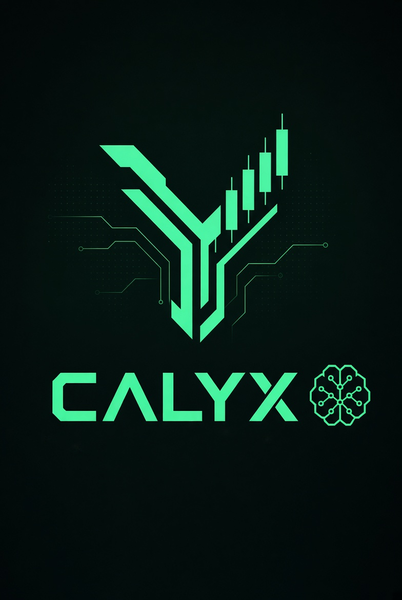
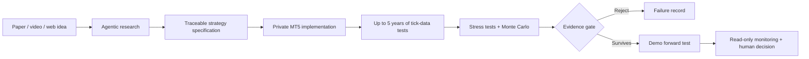

<p align="center">
  
</p>

<h1 align="center">Calyx Agentic Trading Platform</h1>

<p align="center">
  An evidence-first system for turning research ideas into statistically challenged, human-governed trading experiments.
</p>

<p align="center">
  <a href="https://calyx.duckdns.org/"><strong>Visit the live Calyx website →</strong></a>
</p>

Calyx is a human-governed research system that turns ideas from trading papers and videos into explicit strategy specifications, native MetaTrader 5 experiments, robustness audits and monitored forward tests.

This clean repository is designed to explain and demonstrate the engineering without publishing proprietary trading IP. It contains the portfolio website and the reusable evidence-analysis layer. EA source code, compiled builds, strategy presets, credentials, account data and generated results are intentionally excluded.

## Product overview

The system combines research agents, browser and document tools, an expert algorithmic-trading workflow, native MetaTrader 5 testing, statistical robustness checks and read-only forward-test monitoring. The operator primarily reviews evidence and controls promotion decisions instead of manually repeating every research and testing step.

**Live product:** [https://calyx.duckdns.org/](https://calyx.duckdns.org/)



## What it demonstrates

- Multi-tool research ingestion through browser, PDF and video-transcript workflows
- Agentic conversion of unstructured ideas into traceable, testable rules
- Native MT5 report parsing and cost-aware validation
- Monte Carlo and 10,000-path block-bootstrap robustness testing
- Wilson intervals, expected shortfall and deflated Sharpe probability
- Chronological stability checks and point-in-time macro joins
- Policy-driven rejection or promotion to isolated forward testing
- Read-only monitoring with a human decision boundary

## Repository map

```text
agentic_flow/   Reusable research, macro and statistical audit components
website/        Runnable FastAPI portfolio website
docs/           Architecture, pipeline and security documentation
tests/          Public-surface smoke and statistics tests
```

See [the architecture](docs/architecture.md), [research pipeline](docs/research-pipeline.md), and [security boundary](docs/security-and-scope.md).

## Run locally

Python 3.12 or newer is recommended.

```powershell
python -m venv .venv
.\.venv\Scripts\Activate.ps1
python -m pip install -e ".[dev]"
uvicorn website.main:app --reload --host 127.0.0.1 --port 8080
```

Open `http://127.0.0.1:8080`. Run the checks with:

```powershell
pytest
```

## Research command

```powershell
python -m agentic_flow.calyx_pipeline --help
```

The only optional credential used by the published flow is `FXMD_API_KEY`; keep it in the local environment and never commit it. Copy `.env.example` if you need a reminder of the variable name.

## Safety statement

Historical and simulated performance do not guarantee future results. A pipeline pass is eligibility for isolated demo forward testing, not approval for live capital. The system keeps the human operator responsible for promotion and deployment decisions.
