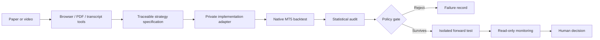

# Architecture

## Public components

- `website/` presents the system, workflow, safeguards and live-site link.
- `agentic_flow/calyx_pipeline.py` parses native MT5 reports and produces robustness evidence.
- `agentic_flow/fxmacrodata.py` provides optional, point-in-time-aware macro data access.
- `agentic_flow/news_pulse_calendar.py` builds reproducible tester calendars.
- `agentic_flow/news_pulse_macro_audit.py` audits schedule and macro-event coverage.
- `agentic_flow/pipeline-policy.json` keeps promotion criteria explicit and reviewable.
- `agentic_flow/prompts/` packages the canonical operating prompt and supplemental MCP bootstrap prompt so a fresh agent can recover the same evidence and safety contract.

## Private adapters

Strategy generation, MetaTrader execution, EA source, compiled binaries, presets, broker connectivity and live-account telemetry are deliberate private boundaries. This repository documents their interfaces without publishing the implementations.

The public prompts therefore use environment placeholders and capability descriptions. A private runtime may inject the exact workspace, terminal, expected account identity, strategy roster, and deployment state, but those values must not be committed or emitted in public logs.

## Governance

Automation may collect evidence, generate candidates and run analyses. It does not silently promote a candidate to live capital. `PASS_FOR_FORWARD_TEST` only means the candidate may enter an isolated demo evaluation after human review.
