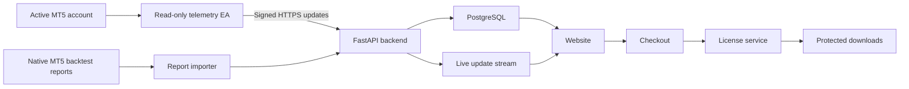

# EA Store Website Plan

## Objective

Create a modern website where Expert Advisors can be presented and sold individually or as a complete package. The website will clearly separate backtest results from live performance and provide detailed strategy explanations, charts, statistics, live account equity, open positions, and trade history.

This document is planning only. No website, MT5 connector, payment system, or licensing system should be built until the implementation is approved.

## Core principles

- Sell each EA individually and offer a discounted complete package.
- Show honest, reproducible performance data.
- Clearly label backtests, locked validation and live trading results.
- Never describe projected or simulated profit as guaranteed.
- Use a modern, professional and mobile-friendly design.
- Keep the public website completely separated from trade execution.
- Never expose an MT5 password, broker credentials or full account number.

## Website pages

### 1. Home page

The home page will contain:

- A modern hero section explaining the EA collection.
- A short explanation of how the systems are tested.
- Featured EAs with their main verified statistics.
- Individual-purchase and complete-package options.
- A preview of the live portfolio performance.
- A clear risk disclaimer.
- Links to the EA catalogue and complete portfolio page.

### 2. EA catalogue

Each EA will appear as a product card showing:

- EA name.
- Strategy category.
- Recommended symbol and timeframe.
- One-year return.
- Three-year return, when sufficient data exists.
- Profit factor.
- Maximum equity drawdown.
- Number of trades.
- Backtest or live status.
- Individual price.
- `View details` and `Buy EA` actions.

Catalogue filters should include:

- Gold and metals.
- Indices.
- Forex.
- Crypto.
- Stocks.
- Strategy category.
- Timeframe.
- Maximum drawdown.
- Minimum profit factor.

### 3. Individual EA detail page

Every EA will have its own detailed page.

#### Strategy information

- Plain-language explanation of the trading logic.
- Exact symbol and timeframe requirements.
- Market session used by the EA.
- Entry conditions.
- Stop-loss and take-profit logic.
- Trailing-stop or trade-management logic.
- Risk-sizing method.
- Recommended settings.
- Broker or symbol limitations.

#### Performance section

Provide selectable periods:

- Last year.
- Any custom range from 7 days through 10 years (subject to available broker history).
- Full available history.
- Locked out-of-sample validation.
- Live account performance.

Display:

- Balance and equity curves.
- Drawdown graph.
- Monthly returns.
- Initial and final balance.
- Net and gross profit.
- Profit factor.
- Win rate.
- Maximum balance and equity drawdown.
- Total trades.
- Wins and losses.
- Average and largest win/loss.
- Long-versus-short statistics.
- Commission, swap and spread assumptions.
- Broker, symbol, testing model and history quality.

Backtests and live results must use visibly different labels and must never be combined into one misleading curve.

#### Live chart examples

Annotated price charts will explain real examples of the strategy:

- Setup formation.
- Signal candle or market condition.
- Entry price.
- Stop loss.
- Take profit.
- Trailing-stop movement.
- Exit reason.
- Explanation of why the EA accepted or rejected the setup.

Historical examples can be loaded from stored MT5 market data. Live examples can update from the connected MT5 account. A self-hosted chart library should be used so the price data source and licensing remain under control.

#### Purchase section

- Individual EA price.
- What files are included.
- License conditions.
- Supported MT5 account types.
- Update and support policy.
- Purchase button.
- Link to the complete package.

### 4. Complete portfolio page

This page will show all approved EAs running together.

#### Historical portfolio data

- Combined chronological equity curve.
- One-year, three-year and full-history views.
- Combined return.
- Combined maximum drawdown.
- Profit factor.
- Win rate.
- Total trades.
- Monthly returns.
- Contribution from each EA.
- Correlation between EAs.
- Overlapping exposure by symbol and direction.

The combined portfolio must be reconstructed chronologically from individual trades. Headline returns must not simply be added together.

#### Live portfolio data

- Current balance.
- Current equity.
- Floating profit or loss.
- Realized profit.
- Daily, weekly and monthly performance.
- Open positions.
- Pending orders.
- Recent closed trades.
- EA name and magic number responsible for each trade.
- Exposure by symbol.
- Exposure by direction.
- Live connection status and last update time.

### 5. Pricing and package page

Purchase options:

- One EA.
- A custom multi-EA bundle.
- Complete EA portfolio.
- Optional future updates or support subscription.
- Optional source-code license sold separately, if desired.

The page should clearly explain:

- What the customer receives.
- Number of allowed MT5 accounts.
- Demo and live-account rules.
- Update entitlement.
- Support period.
- Refund policy.
- Risk disclaimer.

### 6. Customer account area

After purchasing, the customer can access:

- Purchased products.
- Compiled `.ex5` downloads.
- Recommended `.set` files.
- Installation guide.
- Symbol and timeframe guide.
- EA version history.
- License status.
- Registered MT5 account numbers.
- Available updates.
- Support contact or ticket history.

Download links should be temporary and protected rather than public URLs.

### 7. Administration area

The private administration area should allow the owner to:

- Add, edit or hide an EA.
- Upload `.ex5` and `.set` files.
- Upload MT5 reports and graph images.
- Import standardized backtest results.
- Write and edit strategy explanations.
- Add annotated chart examples.
- Set EA and package prices.
- Select which results are public.
- Manage users, orders and licenses.
- Publish new EA versions.
- Revoke compromised downloads or licenses.
- Monitor the MT5 live-data connection.
- Review website and payment errors.

## Proposed technical architecture

### Frontend

- Next.js with TypeScript.
- Tailwind CSS.
- A restrained, reusable component system.
- Interactive financial charts using a self-hosted chart library.
- Responsive layouts for mobile, tablet and desktop.

### Backend

- FastAPI.
- Python dependencies managed with `uv`.
- Pydantic validation.
- SQLAlchemy and Alembic for database access and migrations.
- REST endpoints for catalogue, products, reports and customer accounts.
- Server-Sent Events or WebSockets for live account updates.

### Storage

- PostgreSQL for structured data.
- Private object storage for EA binaries, settings, reports and images.
- Optional Redis for live-event fan-out, caching and background jobs.

### Payments and authentication

- A supported payment provider for checkout, refunds and payment webhooks.
- Secure customer authentication with email verification and password recovery.
- Optional two-factor authentication for the administration area.

### Hosting

- Website frontend hosted separately from the trading VPS.
- FastAPI and PostgreSQL hosted on a secure application server.
- MT5 and the live telemetry connector hosted on a Windows VPS.
- HTTPS and a firewall enabled for every public service.

## Data flow

## MT5 live telemetry plan

A dedicated read-only telemetry EA will run on the selected active MT5 account. It will publish website data but will not accept remote trading instructions.

Data to publish:

- Account balance and equity.
- Floating profit and loss.
- Margin information.
- Open positions.
- Pending orders.
- Closed trades.
- Symbol, direction, volume and execution prices.
- Stop loss and take profit.
- EA magic number and strategy identity.
- Realized commission and swap.
- Connection heartbeat and timestamp.

Recommended update behaviour:

- Send position and trade events immediately.
- Send equity snapshots every few seconds.
- Store lower-frequency historical snapshots after aggregation.
- Mark the website as delayed or disconnected when heartbeats stop.

The public website must display:

- `Live`, `Delayed` or `Disconnected` status.
- Timestamp of the last update.
- Broker-server timezone where relevant.
- Whether the account is demo or live.

## Security requirements

- Do not store the MT5 master password in the website.
- Prefer an investor/read-only account where possible.
- The telemetry EA should only make outbound HTTPS requests.
- Give every installation a revocable API token.
- Sign requests and reject expired timestamps or replayed messages.
- Encrypt secrets at rest.
- Mask account numbers and ticket numbers in public views.
- Separate website administration from trading infrastructure.
- Keep payment and license webhooks authenticated.
- Scan uploaded files and restrict allowed file types.
- Log administrative changes and license actions.
- Maintain encrypted backups.

## Standardized performance-data process

Before an EA is published, its evidence should be standardized.

Required information:

- EA name and version.
- Exact symbol and timeframe.
- Broker and server.
- Testing dates.
- Initial balance.
- Risk per trade.
- Leverage.
- MT5 modelling method.
- History quality.
- Spread, commission, swap and delay assumptions.
- Training period.
- Untouched validation period.
- One-year, three-year and full-history statistics.
- Native MT5 report.
- Best settings file.

Results should be rejected or clearly marked when:

- The test contains no trades.
- History quality is inadequate.
- The report cannot be reproduced.
- Costs were excluded without disclosure.
- Drawdown or returns are derived from incomplete data.
- The selected configuration was evaluated only on optimized training data.

## Core database entities

- EA product.
- EA version.
- Strategy configuration.
- Symbol and timeframe support.
- Backtest run.
- Backtest statistics.
- Equity and drawdown points.
- Live MT5 account.
- Live account snapshot.
- Live position and order.
- Closed trade.
- Product and package price.
- Customer.
- Order and payment.
- Download entitlement.
- License and registered MT5 account.
- Version update.
- Audit log.

## Licensing plan

A practical license can be bound to:

- Customer.
- Product and EA version.
- MT5 account number.
- Demo or live account status.
- Maximum number of accounts.
- Activation and expiration dates.

The EA can periodically verify its license through HTTPS. A short offline grace period should prevent temporary internet problems from disabling an active trade unexpectedly.

Customers should receive compiled `.ex5` files by default. Source code should only be included under a separate, more expensive source-code license.

## UI direction

- Dark-first professional trading design with an optional light mode.
- Graphite or black surfaces with one main accent colour.
- Clean typography and generous spacing.
- Restrained animation focused on chart updates.
- Interactive equity, drawdown and price charts.
- Compact statistics rather than oversized profit claims.
- Clear green/red values paired with labels so meaning does not depend only on colour.
- Desktop-focused live dashboard with a fully usable mobile catalogue and checkout.
- No fake live counters or guaranteed-profit language.

## Delivery phases

### Phase 1: EA and evidence audit

- Decide which EAs are sellable.
- Collect each `.ex5`, `.set`, source file and MT5 report.
- Standardize EA names, versions and magic numbers.
- Validate the reported statistics.
- Write the public strategy descriptions.

### Phase 2: Design prototype

- Define the brand, colours and typography.
- Design the home page.
- Design the catalogue.
- Design one complete EA detail page.
- Design the combined portfolio page.
- Design mobile layouts.

### Phase 3: Catalogue MVP

- Build the frontend and FastAPI backend.
- Build the database.
- Add products and packages.
- Import historical MT5 reports.
- Display performance tables and charts.
- Add the administration area for EA content.

### Phase 4: Payments and protected delivery

- Add customer accounts.
- Add checkout and payment webhooks.
- Add protected downloads.
- Add purchase history.
- Add account-bound licensing.
- Add version updates.

### Phase 5: Live MT5 dashboard

- Build the read-only telemetry EA.
- Add signed live-data ingestion.
- Store equity snapshots and trade events.
- Add live account status.
- Add open positions and trade logs.
- Add the combined live portfolio graph.

### Phase 6: Validation and private launch

- Test all purchase and download paths.
- Test license activation and offline behaviour.
- Test MT5 disconnection and reconnection.
- Test mobile and desktop layouts.
- Review security and backups.
- Launch privately to a small number of users.
- Fix issues before the public release.

## Recommended MVP boundary

The first usable version should contain:

- Home page.
- EA catalogue.
- Individual EA pages.
- Uploaded one-year, three-year and full-history MT5 results.
- Native graphs and downloadable documentation.
- Individual and complete-package checkout.
- Customer downloads.
- Simple account-bound licensing.
- Basic administration area.

The first version should not require live MT5 telemetry to start selling. The live portfolio dashboard can be added once the catalogue, payments, delivery and licensing flow are stable.

## Decisions required before implementation

- Brand and domain name.
- Final list of sellable EAs.
- Individual and package prices.
- Number of allowed MT5 accounts per license.
- Lifetime license versus subscription.
- Whether updates are included permanently.
- Whether source code will ever be sold.
- Live account or demo account used for public telemetry.
- Performance data that can safely be made public.
- Refund and support policies.
- Payment provider and business country.

## Completion criteria

The project will be considered ready for public release when:

- Every listed EA has reproducible evidence.
- Backtest and live data are unmistakably separated.
- Checkout, licensing and downloads work end to end.
- No MT5 trading credentials are exposed.
- Live data failures do not affect MT5 trading.
- The site works on mobile and desktop.
- Legal pages, risk warnings and policies are published.
- Monitoring and backups are active.
